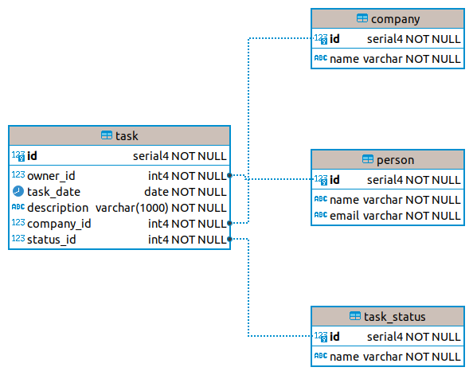

# coding-challenges

# Backend

## Data Schema



## Dependencies

* fastapi
* sqlalchemy
* sqlmodel
* uvicorn
* mangum

I chose [FastAPI](https://fastapi.tiangolo.com/) for the API (amongst other reasons) because it is lightweight,
produces readable code, and provides documentation (Swagger) and data validation out of the box.

[SqlAlchemy](https://www.sqlalchemy.org/) is a powerful data layer and ORM framework.

[SqlModel](https://sqlmodel.tiangolo.com/) builds on the shoulders of SqlAlchemy and FastAPI to reduce boilerplate,
increase velocity while allowing the most advanced scenarios when needed.

[Uvicorn](https://www.uvicorn.org/) is used as the server for the web requests and responses. It supports async and is
very fast and efficient.

[Mangum](https://github.com/jordaneremieff/mangum) is used to allow the service to be used within the AWS ecosystem.

## Backend local testing

You can run the backend locally on your machine for testing purposes. Firstly, in a terminal change to the backend
directory.

You will first need to install [pyenv](https://github.com/pyenv/pyenv) on your local machine if you don't have it
already. `Pyenv` is used to support multiple versions of Python on your machine without affecting your system python
version.

Once you have pyenv installed, create the virtual environment:

```commandline
pyenv install 3.8.13 # If not installed already
python --version
# This should output Python 3.8.13
python -m venv .venv # Create a virtual environment based on the selected Python version
source .venv/bin/activate # Activate the virtual environment
```     

Then install the project requirements

```commandline
pip install -r requirements.txt
```

You are now ready to run the web server locally:

```commandline
uvicorn api:app --reload

# The API endpoints are available on: http://127.0.0.1:8000/api/v1/
# The API autogenerated documentation is available on: http://127.0.0.1:8000/api/v1/docs
```

## Backend deployment to AWS

Deployment to AWS is done using [serverless](https://www.serverless.com/framework/docs/)

```commandline
npm install -g serverless
serverless config credentials --provider aws --key <YOUR_KEY> --secret <YOUR_SECRET_KEY>
sls deploy --stage staging
```
