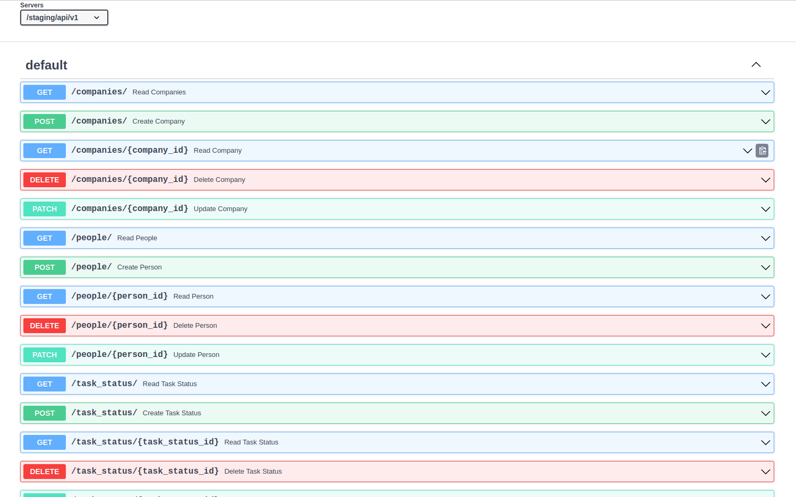
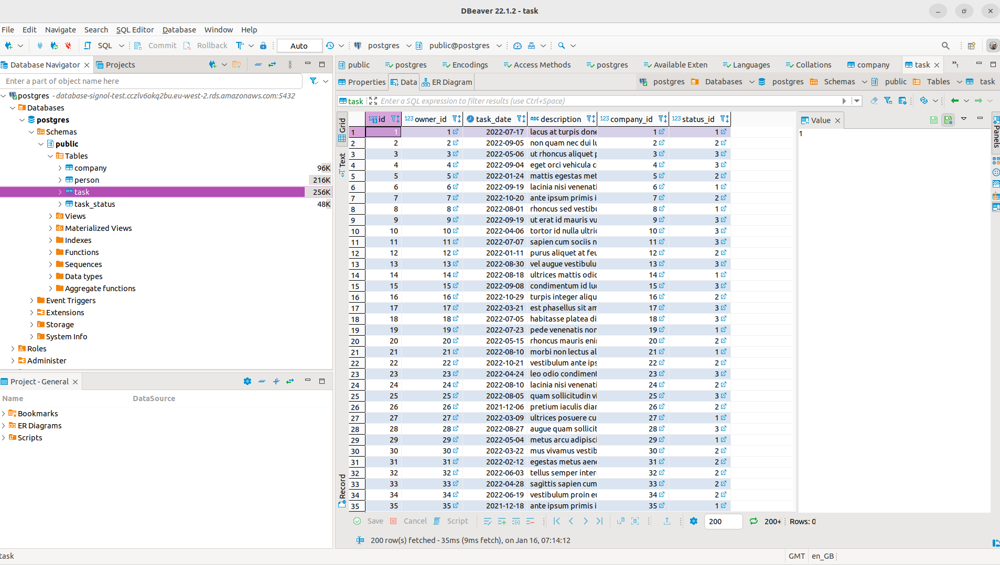

# coding-challenges

# Backend

The code challenge presented a full stack architecture design. To keep the task within timescales I decided to create a
backend only, which would allow any front end (web, mobile, CLI) to work with it in the future.

The backend has been fully deployed to AWS as per the architecture diagram using an API Gateway, AWS Lambda, and 
RDS PostgresSQL database.

Thanks to the autogenerated API documentation the backend can be managed manually using the Swagger interface. 
I'm happy to provide the AWS url for the service on request, so it can be reviewed.



[Serverless](https://www.serverless.com/framework/docs/) is used for easy and consistent deployment to AWS. This could
be used as the basis for a CICD pipeline.

I enjoyed this challenge, and learned a bit about AWS in the process. I wish I had more time to write a frontend but 
happy that I was able to create a solid backend that can be relied on.


## Data Schema

The data schema is based on my interpretation of the code challenge. There are many ways to design the schema based on
the client requirements. This should normally be the outcome of discussions within the team, but for the purpose of the
challenge I made assumptions.


Data Schema



Sample data loaded from the provided CSV file (via the API)

## Dependencies

The solution is using the following libraries:

* fastapi
* sqlalchemy
* sqlmodel
* uvicorn
* mangum

I chose [FastAPI](https://fastapi.tiangolo.com/) for the API (amongst other reasons) because it is lightweight,
produces readable code, and provides documentation (Swagger) and data validation out of the box.

[SqlAlchemy](https://www.sqlalchemy.org/) is a powerful data layer and ORM framework.

[SqlModel](https://sqlmodel.tiangolo.com/) builds on the shoulders of SqlAlchemy and FastAPI to reduce boilerplate,
increase velocity while allowing the most advanced scenarios when needed.

[Uvicorn](https://www.uvicorn.org/) is used as the server for the web requests and responses. It supports async and is
very fast and efficient.

[Mangum](https://github.com/jordaneremieff/mangum) is used to allow the service to be used within the AWS ecosystem.


## Backend local testing

You can run the backend locally on your machine for testing purposes. Firstly, in a terminal change to the backend
directory.

You will first need to install [pyenv](https://github.com/pyenv/pyenv) on your local machine if you don't have it
already. `Pyenv` is used to support multiple versions of Python on your machine without affecting your system python
version.

Once you have pyenv installed, create the virtual environment:

```commandline
pyenv install 3.8.13 # If not installed already
python --version
# This should output Python 3.8.13
python -m venv .venv # Create a virtual environment based on the selected Python version
source .venv/bin/activate # Activate the virtual environment
```     

Then install the project requirements

```commandline
pip install -r requirements.txt
```

You are now ready to run the web server locally:

```commandline
uvicorn api:app --reload

# The API endpoints are available on: http://127.0.0.1:8000/api/v1/
# The API autogenerated documentation is available on: http://127.0.0.1:8000/api/v1/docs
```

## Backend deployment to AWS

Deployment to AWS is done using [serverless](https://www.serverless.com/framework/docs/)

```commandline
npm install -g serverless
serverless config credentials --provider aws --key <YOUR_KEY> --secret <YOUR_SECRET_KEY>
sls deploy --stage staging
```

