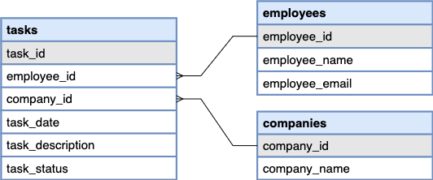

# Task Management Panel


## About the project

### Description

This project implements a task management panel for managers.

With this panel, the managers can:
- View all tasks information
- Update the status of tasks in real-time
- Add new tasks in bulk using CSV files

The frontend is created using ReactJS and the backend is implemented in Postgres. The Postgres database is deployed on Amazon AWS RDS.

### Database Schema

## Getting Started

### Requirements

* NodeJS
* Postgres
* pgAdmin (or any other development platform for Postgres)

### Setting up

1. Clone this repository
   ```
    git clone https://github.com/syedsaifhasan/signol-coding-challenge.git
    ```
2. Run the client side (Note: _--force_ flag used to avoid broken dependencies)
    ```
    cd client 
   npm i --force
    npm start
    ```
3. Run the server side (Note: _--force_ flag used to avoid broken dependencies)
    ```
   cd server
   npm i --force
   npm start
    ```

## Authors

Syed Saif Hasan

[@syedsaifhasan](https://github.com/syedsaifhasan)
