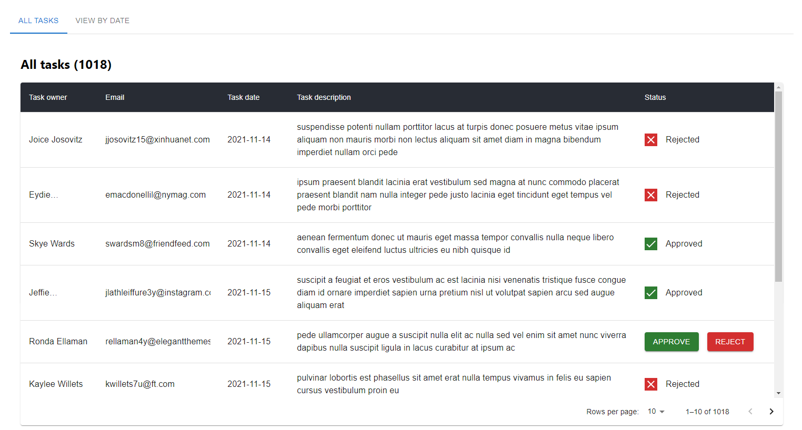
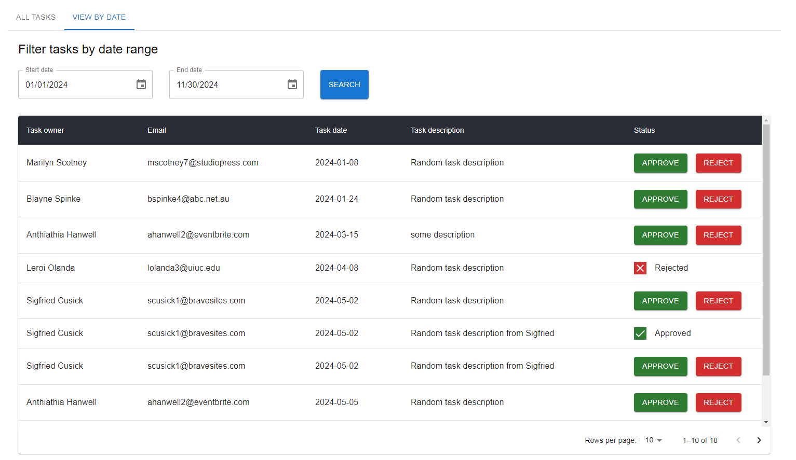
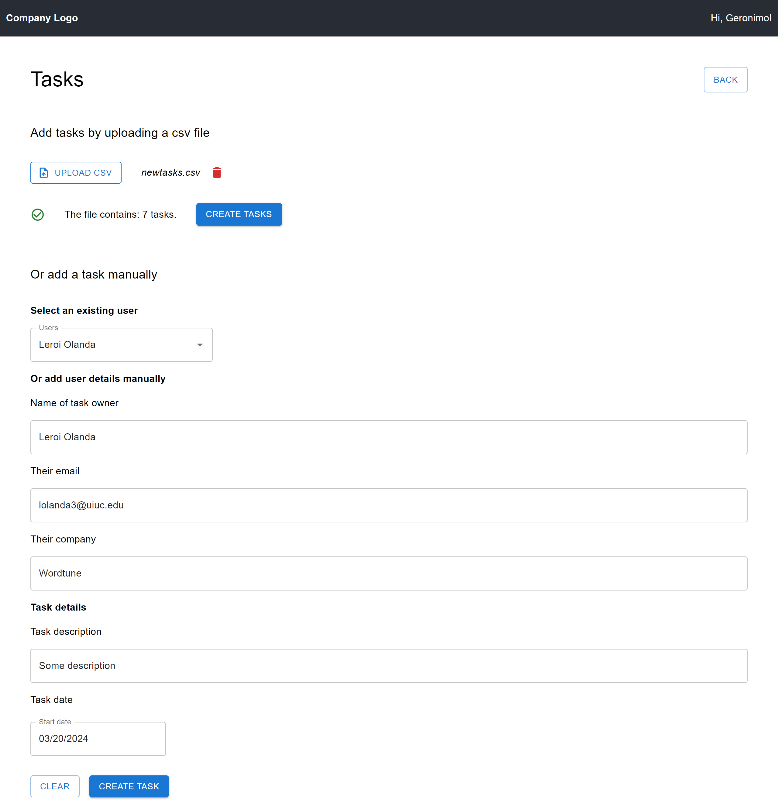
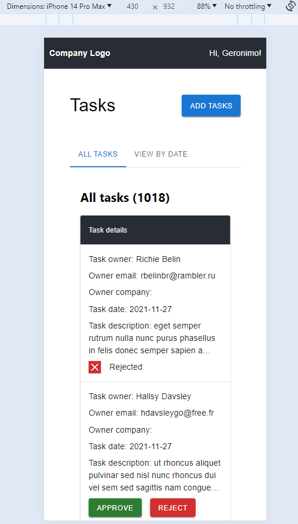
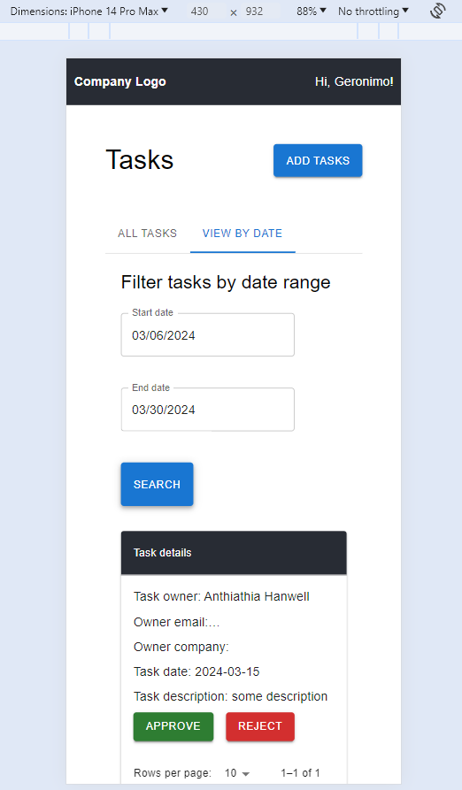
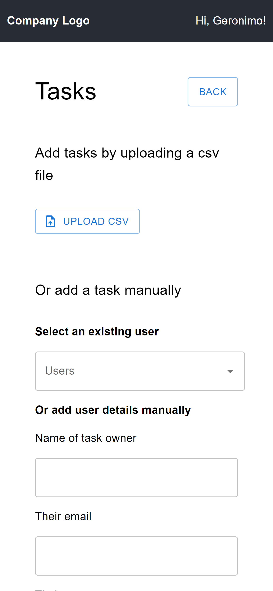

# Signol - challenge - Frontend

This project is part of the Signol full stack challenge. You can view the deployed version [here](http://sam2-websitebucket-fjrjfopk9wed.s3-website-eu-west-1.amazonaws.com/).

## Installation

If you prefer to run this frontend locally, you can clone the repo and :

- in your terminal, at your prefered location: `git clone {repo url or ssh link}`
- `cd {repo name}`
- `cd sam2\frontend`
- `npm install`
- `npm run start`

## Structure of the app

The project is built with React, TypeScript, MUI.
It uses packages such as Papaparse for csv file parsing, dayjs to handle dates, @tanstack/react-query to handle queries and mutations and axios to process the requests.

The app is made of 1 page where the user can:

- view the company tasks
- interact with a task to either approve or reject it
- and add some new tasks, either manually for only 1 task or by uploading a csv file

Example csv files for you to try are available in the example-data folder in this repo.

## Views

### Desktop

View tasks

Add tasks

### Mobile

View tasks

Add tasks

## Learn More

You can contact me by sending me an email at amelie.pira@gmail.com.
