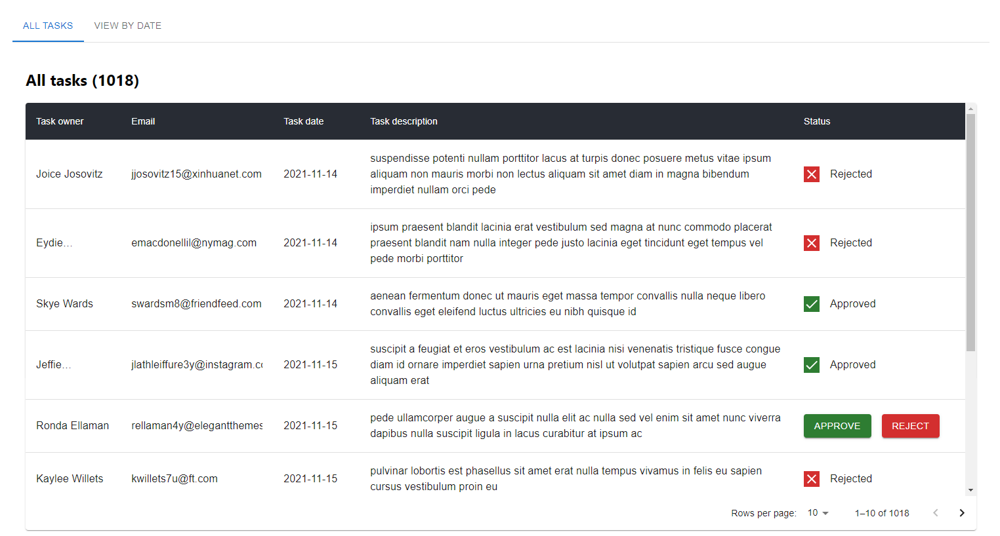
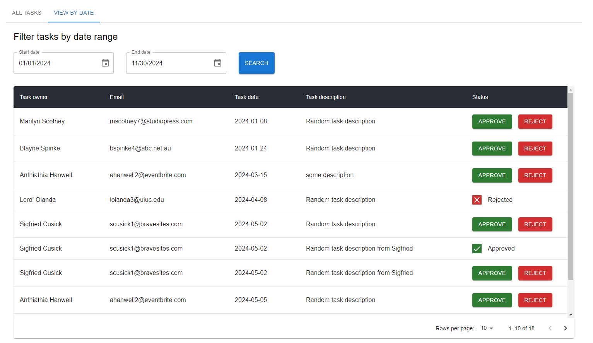
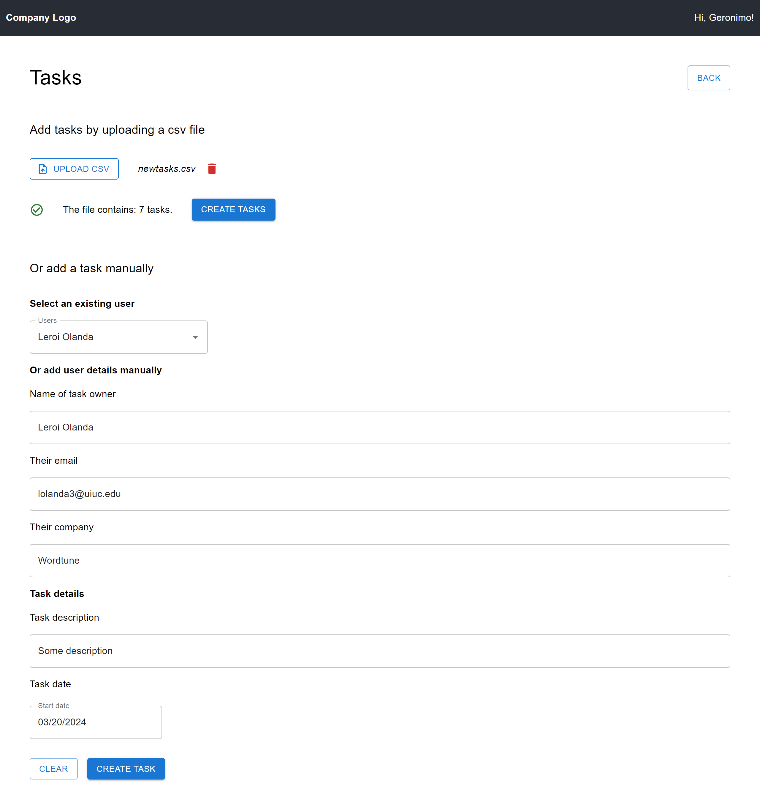
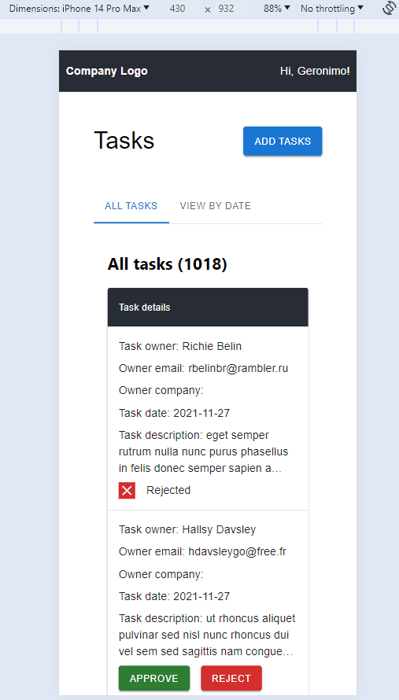
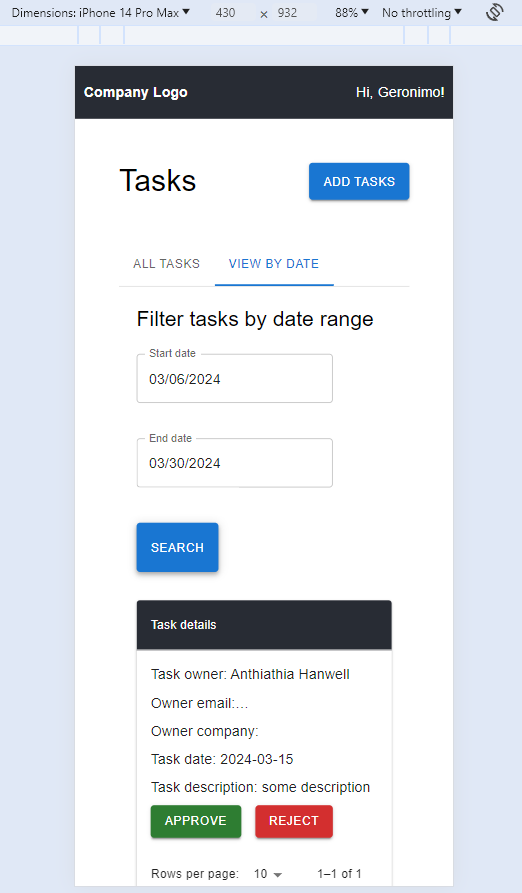
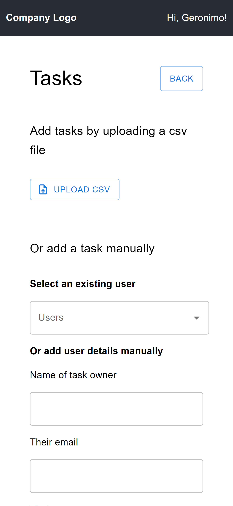

# Signol - challenge - Frontend

This project is part of the Signlo full stack challenge. You can view the deployed version [here]().

## Installation

If you prefer to run this project locally, you can clone the repo and :

- in your terminal, at your prefered location: `git clone {repo url or ssh link}`
- `cd {repo name}`
- `npm install`
- `npm run start`

## Structure of the app

The project is built with React, TypeScript, MUI.
It uses packages such as Papaparse for csv file parsing, dayjs to handle dates, @tanstack/react-query to handle queries and mutations and axios to process the requests.

The app is made of 1 page where the user can:

- view the company tasks
- interact with a task to either approve or reject it
- and add some new tasks, either manually for only 1 task or by uploading a csv file

Example csv files for you to try are available in the example-data folder in this repo.

## Views

### Desktop

View tasks

Add tasks

### Mobile

View tasks

Add tasks

## Further improvements and developments

Possible changes and extensions are:

- add tests all round (rendering and behaviours on clicks etc)
- investigate further functionalities for the app, so that it offers a bit more to the user
- investigate further the styling and design aspects. While it is mobile friendly, it is not 'slick' yet.
- add more validation thoughout (field checks and csv parsing checks)
